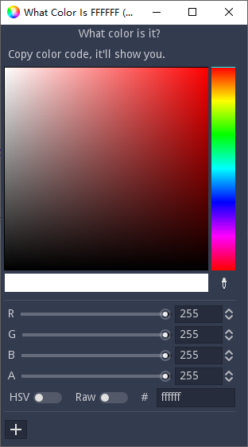

#  What Color Is FFFFFF


- [Installation](#installation)
- [Usage](#usage)
- [From Source](#from-source)
- [License](#license)

------

A simple tool to visualize hex color code.

*Made with [Godot](https://godotengine.org/).*



## Installation

[Release](https://github.com/Adanelia/what_color_is_FFFFFF/releases).

Just run the executable file, no installation required.

## Usage
Copy your color code and switch to the app window, it'll show color in the color picker.

### Supported format
```
#FFFFFFFF
#ffffffff
FFFFFFFF
ffffffff
#FFFFFF
#ffffff
FFFFFF
ffffff
#FFFF
#ffff
FFFF
ffff
#FFF
#fff
FFF
fff
```

As described in the Godot docs:

```
## https://docs.godotengine.org/en/stable/classes/class_color.html#class-color-method-color
# Each of the following creates the same color RGBA(178, 217, 10, 255).
var c1 = Color("#ffb2d90a") # ARGB format with "#".
var c2 = Color("ffb2d90a") # ARGB format.
var c3 = Color("#b2d90a") # RGB format with "#".
var c4 = Color("b2d90a") # RGB format.
```

## From Source

### Prerequisites

[Download Godot Engine](https://godotengine.org/download) if you don't have one.

This project was made with *Godot3.4*, but I think any version of *3.x* is ok.

### Steps

1. Clone or download zip.
2. Open Godot Engine, click import and select project.godot file.

## License
MIT License.
